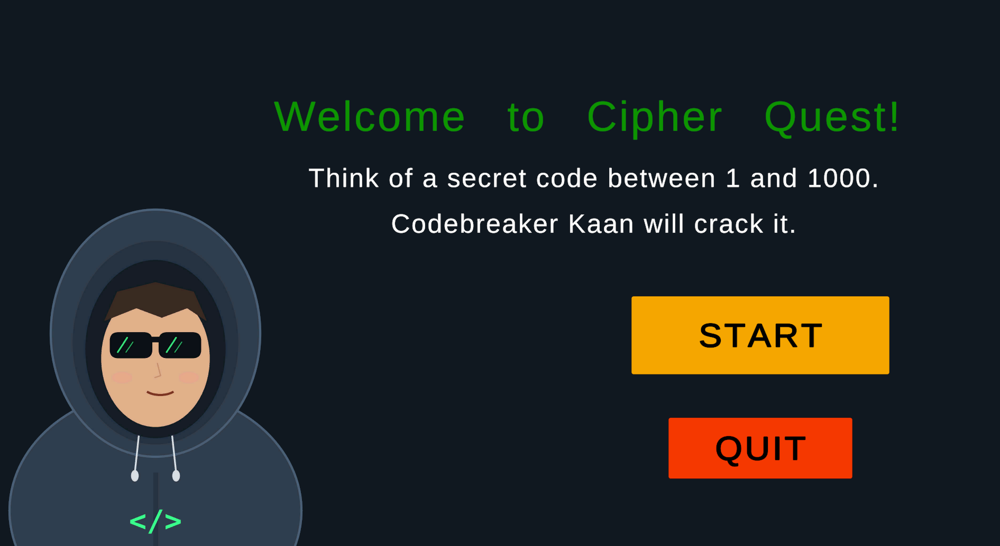
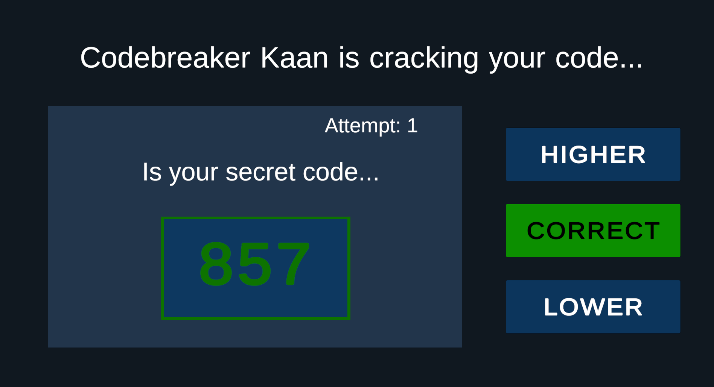
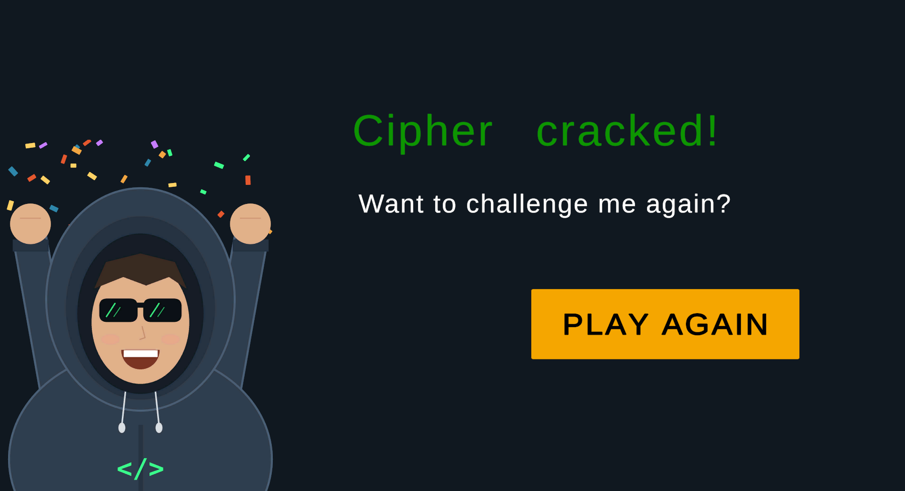

# Cipher Quest

**Cipher Quest** is a button-driven number guessing game developed with Unity for the CENG462 – Game Development course.

The player secretly chooses a number between **1 and 1000**. Codebreaker Kaan attempts to discover the number, while the player responds using:

- **HIGHER**
- **LOWER**
- **CORRECT**

## Game Flow

```text
StartMenu
   |
   | START
   v
CoreGame
   |
   | CORRECT
   v
WinScreen
   |
   | PLAY AGAIN
   v
StartMenu
```

The Start Menu also contains a **QUIT** button.

## Screenshots

### Start Menu



### Gameplay



### Win Screen


